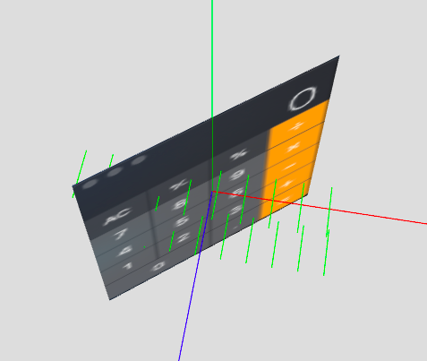

### 物体始终朝向相机

#### 1、通过矩阵操作物体的姿态
如果想要操作矩阵,首先关闭自动更新:
```js
cube.matrixAutoUpdate = false
```

```js
// 这是按z轴旋转45度的旋转矩阵:
[
  0.7, -0.7, 0, 0,
  0.7, 0.7, 0,  0,
  0,    0,  1,  0,
  0,    0,  0,  1
]

// 然后设置矩阵:
cube.matrix.fromArray([
  0.7, -0.7, 0, 0,
  0.7, 0.7, 0,  0,
  0,    0,  1,  0,
  0,    0,  0,  1
])
```
这样就可以了。

#### 2、通过法线方式
思路:
- 根据物体(O)和相机(C)的位置,得到一个向量`OC`
- 根据物体自身面的法线得到另一个向量`ON`
- 两个向量的夹角就是物体需要旋转的角度。

该方式失败,因为物体旋转时，其面对应的法线方向不变。即使调用了:
```js
cube.geometry.computeFaceNormals()
```
法线方向依然不变。


```js
let src = cube.position
let dist = lm.stage.camera.position.clone()
dist.y = src.y

// 向量OC
let dir = new THREE.Vector3()
dir = dir.subVectors(dist, src)
dir = dir.normalize()

// 法线
let normal = cube.geometry.faces[0].normal

let angle = normal.angleTo(dir)
cube.rotation.y = angle
```
